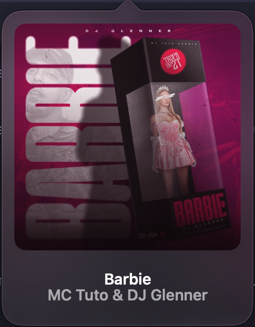

# Faixa

A tiny macOS menu bar player for Apple Music. The album art and a scrolling song title live in the menu bar, and a click opens a Liquid Glass player inspired by [Tuneful](https://github.com/martinfekete10/Tuneful).

*Faixa* is Portuguese for both "track" and "stripe".

Built for macOS 26+. Personal use only.




## Features

- **Now playing in the menu bar:** album art plus the song title scrolling non-stop in a fixed 90 pt window, with soft fades at both edges. The title stops when the song is paused.
- **Stays out of the way:** the menu bar item hides while Apple Music is closed or stopped and comes back as soon as a song starts.
- **Liquid Glass player:** clear glass tinted by a blurred copy of the album art, so the desktop still shows through.
- **Hover controls:** hover the artwork to reveal a glass panel with copy link, previous, play/pause, next and shuffle, plus a draggable progress bar.
- **Copy the Apple Music link** of the current song, looked up through the iTunes Search API.
- **Open in Music:** click the title or artist to reveal the current song in Apple Music.
- **Apple Music red:** shuffle and the "copied" checkmark use Music's own accent color when active.
- **Instant updates:** listens to Apple Music's `com.apple.Music.playerInfo` notifications instead of polling.
- **Native feel:** spacing, title baseline and icon sizes are matched to the system menu bar items.

Right-click the menu bar item to quit. The UI is in Brazilian Portuguese.

## Build

Requires macOS 26+, Xcode 26+ and [XcodeGen](https://github.com/yonaskolb/XcodeGen) from Homebrew (`brew install xcodegen`).

```sh
./scripts/install.sh   # generates the project, builds Release, installs to /Applications and launches it
```

Signing uses my team (`DEVELOPMENT_TEAM` in `project.yml`). Change it to your own team ID before building.

On first launch, macOS asks to let Faixa control Music. Faixa needs it for the artwork, playback position and controls.

## Caveats

- **Apple Music only.** Since macOS 15.4, third-party apps can no longer read the system-wide Now Playing info, so Faixa talks to Music directly through AppleScript and its player notifications.
- **Private view hierarchy:** the clear glass is applied by finding the `NSGlassEffectView` inside `NSPopover`, so a macOS update may change how the player looks.

## Roadmap

- Player in the notch, or a floating pill on Macs without one
- Settings window and open at login

## Acknowledgements

- [Tuneful](https://github.com/martinfekete10/Tuneful) by Martin Fekete, the visual reference for the menu bar item and the player. Faixa's code is written from scratch.
- The [iTunes Search API](https://performance-partners.apple.com/search-api), used to find Apple Music links.

## License

[MIT](LICENSE)
